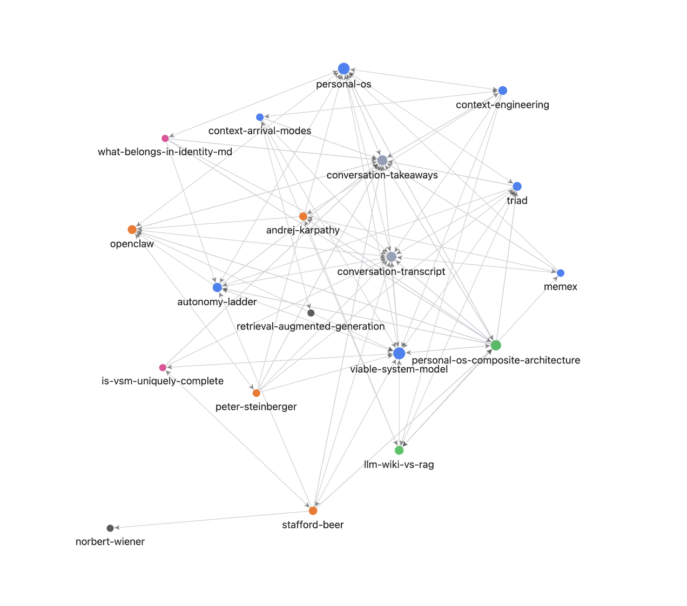

# llm-wiki-starter

A minimal, domain-agnostic template for building a personal knowledge
base that an LLM keeps maintained for you. You curate sources; an
agent writes and maintains the wiki. Pattern from
[Andrej Karpathy's *LLM Wiki* gist](https://gist.github.com/karpathy/442a6bf555914893e9891c11519de94f).



---

## What is an LLM-wiki?

Most LLM-over-documents setups today are RAG: index a pile of files,
retrieve top-k chunks at query time, generate an answer, forget. Ask
the same question tomorrow and the model rediscovers it from scratch.
Nothing accumulates.

An LLM-wiki flips this. Sources still arrive as raw files, but an
agent *maintains* a derived markdown layer between you and them — a
structured, interlinked wiki it owns. Each ingest leaves durable
prose behind: a new concept page, an extended entity, a flagged
contradiction. Future questions read what's already been thought
through. The wiki compounds.

The unlock is maintenance cost. Vannevar Bush proposed the same idea
(Memex, 1945), but no human has the patience to keep a personal wiki
current. LLMs do.

### The three-layer architecture

| Layer | What lives there | Owner |
|---|---|---|
| **Sources** | Immutable raw inputs — papers, transcripts, blog clippings, screenshots, your notes. | You curate; the agent reads but never writes. |
| **Wiki** | Derived markdown — concepts, entities, syntheses, comparisons, questions, plus `index.md` and `log.md`. | The agent owns and maintains it. |
| **Schema** | `CLAUDE.md` (or `AGENTS.md`): page templates, ingest/query/lint workflows, style rules. | You and the agent co-evolve it. |

---

## What it is, on your computer

**A folder of files on your filesystem.** Mostly markdown — plain
text you can `cat`, `grep`, open in any editor. The folder lives
wherever you keep folders: a local directory, an Obsidian vault, an
iCloud-synced directory, a git repo on GitHub.

The directory looks like this:

```
your-wiki/
├── CLAUDE.md          ← schema (agents read this first)
├── README.md
├── sources/           ← Layer 1 — raw, immutable inputs (you curate)
├── wiki/              ← Layer 2 — agent-owned derived markdown
│   ├── index.md           hand-curated entry points
│   ├── overview.md        narrative tour
│   ├── log.md             append-only change log
│   ├── concepts/          ideas, frameworks, terminology
│   ├── entities/          people, orgs, products, papers
│   ├── syntheses/         multi-source thematic essays
│   ├── comparisons/       side-by-side: A vs. B
│   └── questions/         open questions / FAQ
└── derived/           ← optional: charts, decks, exports
```

You interact with that folder three ways:

1. **An LLM agent that reads and writes it directly.** The agent
   maintains the wiki — reads `sources/`, writes pages into `wiki/`,
   appends to `log.md`, follows the rules in `CLAUDE.md`. You speak
   to it in natural language (*"ingest the new paper I just dropped
   in"*; *"what do I know about X?"*) and it modifies the folder.
   Works with **Claude Code**, **Codex CLI**, **Cursor**, **OpenClaw**.
2. **A markdown viewer to read the result.** The wiki uses
   `[[wiki-links]]` to cross-reference pages, so
   [**Obsidian**](https://obsidian.md) is the natural fit — point it
   at the folder (*Open folder as vault*) and you get a navigable
   knowledge graph with backlinks, full-text search, and a graph view
   of how pages connect. VS Code, vim, or any markdown reader works
   too if you just want one page at a time.
3. **The filesystem itself, for everything else.** Drag sources
   into `sources/` via Finder. Sync via iCloud. Version with git.
   Back up by copying the folder. The data is just files.

---

## How it works

The agent runs four operations against the folder:

- **`ingest`** — a new source arrived. The agent reads it, decides
  whether to extend an existing page or create a new one, writes the
  change, and appends to `log.md`.
- **`query`** — you ask a question. The agent answers from `wiki/`
  first, falls back to `sources/`, and surfaces gaps as new entries
  in `questions/`.
- **`lint`** — periodic hygiene: orphans, dead links, missing
  `## Sources` blocks, stale stubs.
- **`recompile`** — the escape hatch. Delete `wiki/`, re-derive every
  page from `sources/` + `CLAUDE.md`. A reproducibility check.

Two files do disproportionate work: `index.md` (the curated table of
contents, hand-tended; not auto-generated) and `log.md` (an
append-only audit trail of every change, dated).

### Editing the schema is the loop

After your first ingest, you'll notice things you'd do differently —
a page split where you'd have merged, the tone off, a template that
doesn't fit your domain. **Don't fix the wiki by hand.** Edit
`CLAUDE.md` instead, ask the agent to re-ingest, and the next pass
produces what you wanted.

The schema is the contract; the wiki is its output. Iterating on the
schema is how a generic template becomes *your* wiki. You can ask
the agent to update `CLAUDE.md` for you — it just doesn't change the
schema unilaterally; that stays human-initiated.

---

## LLM-wiki vs. RAG

| | RAG | LLM-wiki |
|---|---|---|
| **What persists between queries** | Vectors of raw chunks | Synthesized markdown pages |
| **Per-query cost** | Cheap | Cheap |
| **Per-ingest cost** | Low (embedding) | Higher (synthesis) |
| **Cross-references** | None | Every page links |
| **Contradictions** | Silently averaged | Explicitly flagged |
| **Auditability** | Opaque vectors | Cited markdown + log |
| **Human-readable** | No | Yes (`index.md`) |
| **Sweet spot** | Massive, query-diverse | 10–1000 sources, repeated questions |

A wiki shifts the model's work upstream. RAG re-derives every query;
the wiki transforms once at ingest, and every subsequent query reads
the already-thought-through pages. The cost amortizes; the knowledge
compounds.

The practical wins:

- **Cross-references are first-class.** The link graph is part of the artifact.
- **Contradictions surface.** Two sources disagree → both captured in a `## Contradictions` section.
- **You can read it.** Browse, edit, share, version with git, open in Obsidian. A vector index is opaque.
- **Audit is easy.** Every page cites its sources; `log.md` records every change. *"Why does the system think X?"* → open a file.
- **Failures are fixable.** RAG's failure mode (retrieval miss) is silent. The wiki's (a bad summary baked into a page) is visible in the file — and `recompile` rebuilds from sources.

---

## Use cases

### Personal

- **Literature review** — papers in a domain, synthesized as you go.
- **Research area** — a topic you're mastering across textbooks, papers, and blog posts.
- **Onboarding to a new domain** — new job, new stack, new sub-field.
- **Long-running personal interest** — a hobby with a literature.

### Team / enterprise

Same pattern, applied as a *context layer* for an AI-augmented data
or engineering team:

- **Domain context** — *what this thing actually is* (a payment, a market, an alert, a customer).
- **Playbooks** — runbooks, alert response, on-call procedures.
- **Incident postmortems** — postmortems are sources; the wiki finds patterns across them.
- **ML experiment & ablation log** — every experiment is a source; the wiki synthesizes *"what we've learned about X."*
- **Architecture decisions (ADRs)** — proposals are sources; the wiki tracks themes, reversals, contradictions.
- **Customer / user feedback** — support tickets, interviews, NPS responses → a living *"why customers ask about X."*

### When *not* to use it

- **Very large corpora** (>~1000 sources). Vector RAG scales better.
- **Pure lookup / search** ("find me the doc that says X"). Wiki transformations get in the way.
- **Highly dynamic data** (prices, logs, telemetry). Wikis are for slow-changing knowledge.
- **Regulated content requiring verbatim retrieval.** The transformation step complicates audit.

---

## Getting started

For workshop pre-work, see [**WORKSHOP.md**](WORKSHOP.md).

If you'd rather build a wiki without using this template, open
Claude Code in an empty folder and paste:

> ```
> Scaffold an LLM-wiki for the topic <YOUR TOPIC>, following the
> pattern in Andrej Karpathy's gist
> (https://gist.github.com/karpathy/442a6bf555914893e9891c11519de94f).
> Create:
>
> - CLAUDE.md (the schema, with page templates for concepts/entities/
>   syntheses/comparisons/questions and ingest/query/lint workflows)
> - An empty sources/ directory I'll fill in
> - An empty wiki/ tree: concepts/, entities/, syntheses/, comparisons/,
>   questions/, plus index.md, overview.md, log.md
>
> Use kebab-case.md filenames, [[wiki-links]] for cross-references, and
> end every page with a ## Sources section.
> ```

The agent will create the structure from scratch.

---

## Credit

Pattern by [Andrej Karpathy](https://gist.github.com/karpathy/442a6bf555914893e9891c11519de94f).
This template is one concrete instantiation.

## License

MIT — see [`LICENSE`](LICENSE).
